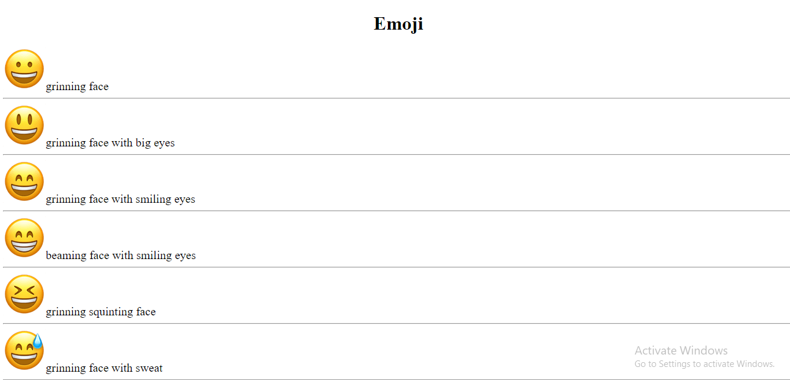

https://624094e02aeb48a9af754d5f.mockapi.io/ticket

1. Call the above API and get the data in the console
2. Understand the type of data you are getting
3. Use DOM Manipulation to display the List of Emoji's with names in User Interface
4. Make sure that Your Submission in **Visually Appealing**
    
